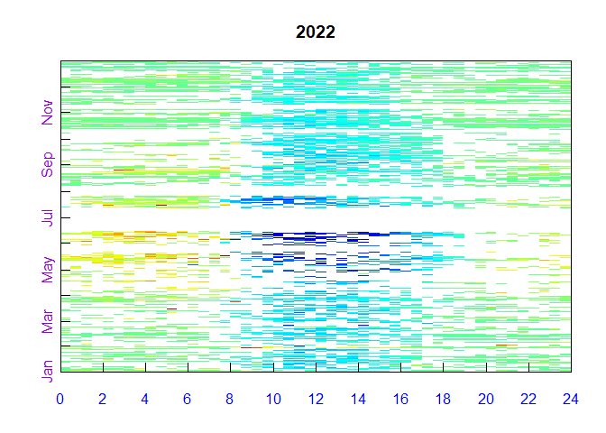
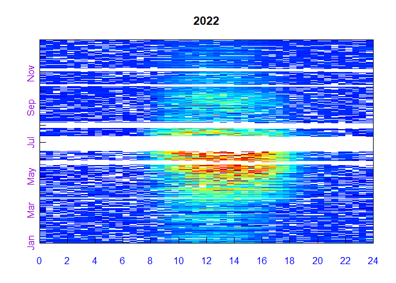
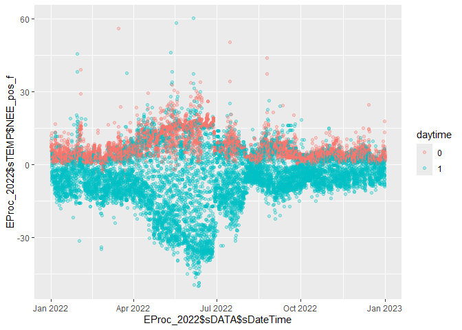
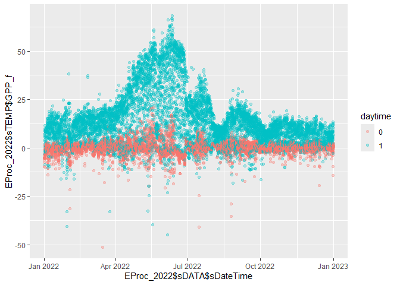

GPP_Test
================
MOEKA
2024-08-01

REdduProc FAQ: <https://www.bgc-jena.mpg.de/5629512/FAQ> NEE
partitioning algorithm paper:
<https://onlinelibrary.wiley.com/doi/10.1111/j.1365-2486.2005.001002.x>

``` r
GPP_2022_output_raw <- read.delim("G:/My Drive/Research/Projects/DC_auto/Data/GPP/CRK_2022_rpresult.txt") %>% slice(-1)
GPP_2023_output_raw <- read.delim("G:/My Drive/Research/Projects/DC_auto/Data/GPP/CRK_2023_rpresult.txt") %>% slice(-1)


GPP_2022_input_raw <- read.csv("G:/My Drive/Research/Projects/DC_auto/Data/GPP/rpCRK_2022.csv") 
GPP_2023_input_raw <- read.csv("G:/My Drive/Research/Projects/DC_auto/Data/GPP/rpCRK_2023.csv")
```

Refs: - calculate the potential radiation:
<https://rdrr.io/rforge/REddyProc/man/fCalcPotRadiation.html> -

``` r
GPP_2022_input <- 
  GPP_2022_input_raw %>% 
  slice(-1) %>% 
  # change to DOY to datetime
  # Add time stamp in POSIX time format
  fConvertTimeToPosix('YDH', Year = 'Year', Day = 'DoY', Hour = 'Hour') %>% 
  # replace sequences of numeritically equal values by NA 
  # Did not change from raw dataet
  filterLongRuns("NEE") 
```

    ## Converted time format 'YDH' to POSIX with column name 'DateTime'.

``` r
GPP_2022_input [GPP_2022_input == -9999] <- NA
GPP_2022_input [GPP_2022_input == NaN] <- NA

# if positive, daytime
GPP_2022_input_NEE_pos <- 
  GPP_2022_input %>% 
  mutate(potRadSolar = fCalcPotRadiation(DoY, Hour, 31.4629, -95.3415, -6, useSolartime = T)) %>% 
  # maybe better use the different matrix to judge day/night
  mutate(NEE_pos = ifelse(potRadSolar == 0 & NEE < 0, NA, NEE)) 
GPP_2022_input_NEE_pos$NEE_pos [GPP_2022_input_NEE_pos$NEE_pos == NaN] <- NA

GPP_2023_input <- 
  # change to DOY to datetime
  fConvertTimeToPosix(GPP_2023_input_raw, 'YDH', Year = 'Year', Day = 'DoY', Hour = 'Hour') %>% 
  # replace sequences of numeritically equal values by NA 
  # Did not change from raw dataet
  filterLongRuns("NEE")
```

    ## Converted time format 'YDH' to POSIX with column name 'DateTime'.

Refs: - gapfill:
<https://rdrr.io/rforge/REddyProc/man/sMDSGapFill.html> - NEE
partitioning:
<https://rdrr.io/rforge/REddyProc/man/partitionNEEGL.html> - Daytime
partitining:
<https://rdrr.io/rforge/REddyProc/man/sGLFluxPartition.html> - nighttime
partitioning:
<https://rdrr.io/rforge/REddyProc/man/sMRFluxPartition.html>

``` r
# Initalize R5 reference class sEddyProc for post-processing of eddy data

EProc_2022 <- 
  #the dataset is spanning from the end of the first (half-)hour (0:30 or 1:00, respectively) and to midnight (0:00)
  # Internally the half-hour time stamp is shifted to the middle of the measurement period
  sEddyProc$new('CRK', GPP_2022_input_NEE_pos, 
                c('NEE_pos', 'LE', 'Rg', 'Tair', 'Tsoil', 'VPD', 'Ustar','SWC_5cm', 'SWC_20cm', "potRadSolar"),
                ColPOSIXTime = "DateTime", DTS = 48,
                LatDeg = 31.4629, LongDeg = -95.3415, TimeZoneHour = -6)
```

    ## New sEddyProc class for site 'CRK'

``` r
# Viz
EProc_2022$sPlotFingerprintY('NEE_pos', Year = "2022")
```

<!-- -->

``` r
EProc_2022$sPlotFingerprintY('LE', Year = "2022")
```

<!-- -->

``` r
# Gapfill
EProc_2022$sMDSGapFill('LE')
```

    ## Initialized variable 'LE' with 4985 real gaps for gap filling of all 17520 values (to estimate uncertainties).

    ## Full MDS algorithm for gap filling of 'LE' with LUT(Rg, VPD, Tair) and MDC.

    ## Look up table with window size of 7 days with Rg VPD Tair

    ## ............................................................
    ## .............................................................
    ## ........................................................13591
    ## Look up table with window size of 14 days with Rg VPD Tair
    ## .......................................146
    ## Look up table with window size of 7 days with Rg
    ## .....................................1735
    ## Mean diurnal course with window size of 0 days: .
    ## ....................1007
    ## Mean diurnal course with window size of 1 days: .
    ## ..........221
    ## Mean diurnal course with window size of 2 days: .
    ## ........139
    ## Look up table with window size of 21 days with Rg VPD Tair
    ## ......0
    ## Look up table with window size of 28 days with Rg VPD Tair
    ## ......0
    ## Look up table with window size of 35 days with Rg VPD Tair
    ## ......0
    ## Look up table with window size of 42 days with Rg VPD Tair
    ## ......0
    ## Look up table with window size of 49 days with Rg VPD Tair
    ## ......0
    ## Look up table with window size of 56 days with Rg VPD Tair
    ## ......0
    ## Look up table with window size of 63 days with Rg VPD Tair
    ## ......0
    ## Look up table with window size of 70 days with Rg VPD Tair
    ## ......0
    ## Look up table with window size of 14 days with Rg
    ## ......615
    ## Look up table with window size of 21 days with Rg
    ## 12
    ## Look up table with window size of 28 days with Rg
    ## 1
    ## Look up table with window size of 35 days with Rg
    ## 0
    ## Look up table with window size of 42 days with Rg
    ## 0
    ## Look up table with window size of 49 days with Rg
    ## 0
    ## Look up table with window size of 56 days with Rg
    ## 0
    ## Look up table with window size of 63 days with Rg
    ## 0
    ## Look up table with window size of 70 days with Rg
    ## 0
    ## Mean diurnal course with window size of 7 days: .
    ## 49
    ## Mean diurnal course with window size of 14 days: .
    ## 4
    ## Finished gap filling of 'LE' in 13 seconds. Artificial gaps filled: 17520, real gaps filled: 4985, unfilled (long) gaps: 0.

``` r
EProc_2022$sMDSGapFill('NEE_pos')
```

    ## Initialized variable 'NEE_pos' with 12004 real gaps for gap filling of all 17520 values (to estimate uncertainties).
    ## Full MDS algorithm for gap filling of 'NEE_pos' with LUT(Rg, VPD, Tair) and MDC.
    ## Look up table with window size of 7 days with Rg VPD Tair
    ## ............................................................
    ## .............................................................
    ## ........................................................11713
    ## Look up table with window size of 14 days with Rg VPD Tair
    ## ..........................................................833
    ## Look up table with window size of 7 days with Rg
    ## .................................................2806
    ## Mean diurnal course with window size of 0 days: .
    ## .....................660
    ## Mean diurnal course with window size of 1 days: .
    ## ...............409
    ## Mean diurnal course with window size of 2 days: .
    ## ..........197
    ## Look up table with window size of 21 days with Rg VPD Tair
    ## .........0
    ## Look up table with window size of 28 days with Rg VPD Tair
    ## .........0
    ## Look up table with window size of 35 days with Rg VPD Tair
    ## .........1
    ## Look up table with window size of 42 days with Rg VPD Tair
    ## .........0
    ## Look up table with window size of 49 days with Rg VPD Tair
    ## .........0
    ## Look up table with window size of 56 days with Rg VPD Tair
    ## .........0
    ## Look up table with window size of 63 days with Rg VPD Tair
    ## .........0
    ## Look up table with window size of 70 days with Rg VPD Tair
    ## .........0
    ## Look up table with window size of 14 days with Rg
    ## .........673
    ## Look up table with window size of 21 days with Rg
    ## ..47
    ## Look up table with window size of 28 days with Rg
    ## .3
    ## Look up table with window size of 35 days with Rg
    ## .1
    ## Look up table with window size of 42 days with Rg
    ## .1
    ## Look up table with window size of 49 days with Rg
    ## .0
    ## Look up table with window size of 56 days with Rg
    ## .0
    ## Look up table with window size of 63 days with Rg
    ## .0
    ## Look up table with window size of 70 days with Rg
    ## .0
    ## Mean diurnal course with window size of 7 days: .
    ## .169
    ## Mean diurnal course with window size of 14 days: .
    ## 7
    ## Finished gap filling of 'NEE_pos' in 13 seconds. Artificial gaps filled: 17520, real gaps filled: 12004, unfilled (long) gaps: 0.

``` r
# maybe better use the different matrix to judge day/night
EProc_2022$sDATA %>% 
  mutate(daytime = ifelse(potRadSolar > 0, "1", "0")) %>% 
  ggplot() + geom_point(aes(EProc_2022$sDATA$sDateTime, EProc_2022$sTEMP$NEE_pos_f, col = daytime), alpha = .3)
```

<!-- -->

``` r
# other vars gapfill
EProc_2022$sMDSGapFill('Tair', FillAll = FALSE,  minNWarnRunLength = NA)     
```

    ## Initialized variable 'Tair' with 1430 real gaps for gap filling.
    ## Limited MDS algorithm for gap filling of 'Tair' with LUT(Rg only) and MDC.
    ## Look up table with window size of 7 days with Rg
    ## ..............69
    ## Mean diurnal course with window size of 0 days: .
    ## .............20
    ## Mean diurnal course with window size of 1 days: .
    ## .............317
    ## Mean diurnal course with window size of 2 days: .
    ## ..........144
    ## Look up table with window size of 14 days with Rg
    ## ........0
    ## Look up table with window size of 21 days with Rg
    ## ........0
    ## Look up table with window size of 28 days with Rg
    ## ........0
    ## Look up table with window size of 35 days with Rg
    ## ........0
    ## Look up table with window size of 42 days with Rg
    ## ........0
    ## Look up table with window size of 49 days with Rg
    ## ........0
    ## Look up table with window size of 56 days with Rg
    ## ........0
    ## Look up table with window size of 63 days with Rg
    ## ........0
    ## Look up table with window size of 70 days with Rg
    ## ........0
    ## Mean diurnal course with window size of 7 days: .
    ## ........275
    ## Mean diurnal course with window size of 14 days: .
    ## ......336
    ## Mean diurnal course with window size of 21 days: .
    ## ..269
    ## Finished gap filling of 'Tair' in 3 seconds. Artificial gaps filled: 17520, real gaps filled: 1430, unfilled (long) gaps: 0.

``` r
EProc_2022$sMDSGapFill('VPD', FillAll = FALSE,  minNWarnRunLength = NA)    
```

    ## Initialized variable 'VPD' with 2627 real gaps for gap filling.
    ## Limited MDS algorithm for gap filling of 'VPD' with LUT(Rg only) and MDC.
    ## Look up table with window size of 7 days with Rg
    ## ..........................1605
    ## Mean diurnal course with window size of 0 days: .
    ## ..........7
    ## Mean diurnal course with window size of 1 days: .
    ## ..........217
    ## Mean diurnal course with window size of 2 days: .
    ## .......130
    ## Look up table with window size of 14 days with Rg
    ## ......608
    ## Look up table with window size of 21 days with Rg
    ## 10
    ## Look up table with window size of 28 days with Rg
    ## 1
    ## Look up table with window size of 35 days with Rg
    ## 0
    ## Look up table with window size of 42 days with Rg
    ## 0
    ## Look up table with window size of 49 days with Rg
    ## 0
    ## Look up table with window size of 56 days with Rg
    ## 0
    ## Look up table with window size of 63 days with Rg
    ## 0
    ## Look up table with window size of 70 days with Rg
    ## 0
    ## Mean diurnal course with window size of 7 days: .
    ## 45
    ## Mean diurnal course with window size of 14 days: .
    ## 4
    ## Finished gap filling of 'VPD' in 1 seconds. Artificial gaps filled: 17520, real gaps filled: 2627, unfilled (long) gaps: 0.

``` r
EProc_2022$sMDSGapFill('Rg', FillAll = FALSE,  minNWarnRunLength = NA)    
```

    ## Initialized variable 'Rg' with 1420 real gaps for gap filling.
    ## Restriced MDS algorithm for gap filling of 'Rg' with no meteo conditions and hence only MDC.
    ## Mean diurnal course with window size of 0 days: .
    ## ..............79
    ## Mean diurnal course with window size of 1 days: .
    ## .............317
    ## Mean diurnal course with window size of 2 days: .
    ## ..........144
    ## Mean diurnal course with window size of 7 days: .
    ## ........275
    ## Mean diurnal course with window size of 14 days: .
    ## ......336
    ## Mean diurnal course with window size of 21 days: .
    ## ..269
    ## Finished gap filling of 'Rg' in 0 seconds. Artificial gaps filled: 17520, real gaps filled: 1420, unfilled (long) gaps: 0.

``` r
EProc_2022$sMDSGapFill('SWC_5cm', FillAll = FALSE,  minNWarnRunLength = NA)    
```

    ## Initialized variable 'SWC_5cm' with 2603 real gaps for gap filling.
    ## Full MDS algorithm for gap filling of 'SWC_5cm' with LUT(Rg, VPD, Tair) and MDC.
    ## Look up table with window size of 7 days with Rg VPD Tair
    ## ..........................623
    ## Look up table with window size of 14 days with Rg VPD Tair
    ## ...................397
    ## Look up table with window size of 7 days with Rg
    ## ...............115
    ## Mean diurnal course with window size of 0 days: .
    ## ..............6
    ## Mean diurnal course with window size of 1 days: .
    ## ..............67
    ## Mean diurnal course with window size of 2 days: .
    ## .............0
    ## Look up table with window size of 21 days with Rg VPD Tair
    ## .............270
    ## Look up table with window size of 28 days with Rg VPD Tair
    ## ...........124
    ## Look up table with window size of 35 days with Rg VPD Tair
    ## ..........21
    ## Look up table with window size of 42 days with Rg VPD Tair
    ## .........19
    ## Look up table with window size of 49 days with Rg VPD Tair
    ## .........4
    ## Look up table with window size of 56 days with Rg VPD Tair
    ## .........4
    ## Look up table with window size of 63 days with Rg VPD Tair
    ## .........0
    ## Look up table with window size of 70 days with Rg VPD Tair
    ## .........0
    ## Look up table with window size of 14 days with Rg
    ## .........2
    ## Look up table with window size of 21 days with Rg
    ## .........8
    ## Look up table with window size of 28 days with Rg
    ## .........0
    ## Look up table with window size of 35 days with Rg
    ## .........0
    ## Look up table with window size of 42 days with Rg
    ## .........0
    ## Look up table with window size of 49 days with Rg
    ## .........0
    ## Look up table with window size of 56 days with Rg
    ## .........0
    ## Look up table with window size of 63 days with Rg
    ## .........0
    ## Look up table with window size of 70 days with Rg
    ## .........0
    ## Mean diurnal course with window size of 7 days: .
    ## .........0
    ## Mean diurnal course with window size of 14 days: .
    ## .........1
    ## Mean diurnal course with window size of 21 days: .
    ## .........102
    ## Mean diurnal course with window size of 28 days: .
    ## ........336
    ## Mean diurnal course with window size of 35 days: .
    ## .....336
    ## Mean diurnal course with window size of 42 days: .
    ## .168
    ## Finished gap filling of 'SWC_5cm' in 6 seconds. Artificial gaps filled: 17520, real gaps filled: 2603, unfilled (long) gaps: 0.

``` r
EProc_2022$sMDSGapFill('SWC_20cm', FillAll = FALSE,  minNWarnRunLength = NA)    
```

    ## Initialized variable 'SWC_20cm' with 2605 real gaps for gap filling.
    ## Full MDS algorithm for gap filling of 'SWC_20cm' with LUT(Rg, VPD, Tair) and MDC.
    ## Look up table with window size of 7 days with Rg VPD Tair
    ## ..........................623
    ## Look up table with window size of 14 days with Rg VPD Tair
    ## ...................397
    ## Look up table with window size of 7 days with Rg
    ## ...............117
    ## Mean diurnal course with window size of 0 days: .
    ## ..............6
    ## Mean diurnal course with window size of 1 days: .
    ## ..............67
    ## Mean diurnal course with window size of 2 days: .
    ## .............0
    ## Look up table with window size of 21 days with Rg VPD Tair
    ## .............270
    ## Look up table with window size of 28 days with Rg VPD Tair
    ## ...........124
    ## Look up table with window size of 35 days with Rg VPD Tair
    ## ..........21
    ## Look up table with window size of 42 days with Rg VPD Tair
    ## .........19
    ## Look up table with window size of 49 days with Rg VPD Tair
    ## .........4
    ## Look up table with window size of 56 days with Rg VPD Tair
    ## .........4
    ## Look up table with window size of 63 days with Rg VPD Tair
    ## .........0
    ## Look up table with window size of 70 days with Rg VPD Tair
    ## .........0
    ## Look up table with window size of 14 days with Rg
    ## .........2
    ## Look up table with window size of 21 days with Rg
    ## .........8
    ## Look up table with window size of 28 days with Rg
    ## .........0
    ## Look up table with window size of 35 days with Rg
    ## .........0
    ## Look up table with window size of 42 days with Rg
    ## .........0
    ## Look up table with window size of 49 days with Rg
    ## .........0
    ## Look up table with window size of 56 days with Rg
    ## .........0
    ## Look up table with window size of 63 days with Rg
    ## .........0
    ## Look up table with window size of 70 days with Rg
    ## .........0
    ## Mean diurnal course with window size of 7 days: .
    ## .........0
    ## Mean diurnal course with window size of 14 days: .
    ## .........1
    ## Mean diurnal course with window size of 21 days: .
    ## .........102
    ## Mean diurnal course with window size of 28 days: .
    ## ........336
    ## Mean diurnal course with window size of 35 days: .
    ## .....336
    ## Mean diurnal course with window size of 42 days: .
    ## .168
    ## Finished gap filling of 'SWC_20cm' in 6 seconds. Artificial gaps filled: 17520, real gaps filled: 2605, unfilled (long) gaps: 0.

``` r
EProc_2022$sFillVPDFromDew() # fill longer gaps still present in VPD_f

#EProc_2022$sSetLocationInfo(LatDeg = 31.4629, LongDeg = -95.3415, TimeZoneHour = -6)

EProc_2022$sMRFluxPartition(FluxVar = "NEE_pos_f", QFFluxVar = "NEE_pos_fqc")
```

    ## Start flux partitioning for variable NEE_pos_f with temperature Tair_f.
    ## Estimate of the temperature sensitivity E_0 from short term data: 97.69.
    ## Regression of reference temperature R_ref for 81 periods.

``` r
# Below is daytime flux partioning 
EProc_2022$sGLFluxPartition(NEEVar = "NEE_pos_f", QFNEEVar = "NEE_pos_fqc", NEESdVar = "NEE_pos_fsd")
```

    ## Start daytime flux partitioning for variable NEE_pos_f with temperature Tair_f.
    ##   Estimating temperature sensitivity from night time NEE , 1, 3, 5, 7, 9, 11, 13, 15, 17, 19, 21, 23, 25, 27, 29, 31, 33, 35, 37, 39, 41, 43, 45, 47, 49, 51, 53, 55, 57, 59, 61, 63, 65, 67, 69, 71, 73, 75, 77, 79, 81, 83, 85, 87, 89, 91, 93, 95, 97, 99, 101, 103, 105, 107, 109, 111, 113, 115, 117, 119, 121, 123, 125, 127, 129, 131, 133, 135, 137, 139, 141, 143, 145, 147, 149, 151, 153, 155, 157, 159, 161, 163, 165, 167, 169, 171, 173, 175, 177, 179, 181, 183, 185, 187, 189, 191, 193, 195, 197, 199, 201, 203, 205, 207, 209, 211, 213, 215, 217, 219, 221, 223, 225, 227, 229, 231, 233, 235, 237, 239, 241, 243, 245, 247, 249, 251, 253, 255, 257, 259, 261, 263, 265, 267, 269, 271, 273, 275, 277, 279, 281, 283, 285, 287, 289, 291, 293, 295, 297, 299, 301, 303, 305, 307, 309, 311, 313, 315, 317, 319, 321, 323, 325, 327, 329, 331, 333, 335, 337, 339, 341, 343, 345, 347, 349, 351, 353, 355, 357, 359, 361, 363
    ##     increase window size to 24, 1, 3, 5, 7, 9, 11, 13, 15, 17, 19, 21, 23, 25, 27, 29, 31, 33, 35, 37, 39, 41, 43, 45, 47, 49, 51, 53, 55, 57, 59, 61, 63, 65, 67, 69, 71, 73, 75, 77, 79, 81, 83, 85, 87, 89, 91, 93, 95, 97, 99, 101, 103, 105, 107, 109, 111, 113, 115, 117, 119, 121, 123, 125, 127, 129, 131, 133, 135, 137, 139, 141, 143, 145, 147, 149, 151, 153, 155, 157, 159, 161, 163, 165, 167, 169, 171, 173, 175, 177, 179, 181, 183, 185, 187, 189, 191, 193, 195, 197, 199, 201, 203, 205, 207, 209, 211, 213, 215, 217, 219, 221, 223, 225, 227, 229, 231, 233, 235, 237, 239, 241, 243, 245, 247, 249, 251, 253, 255, 257, 259, 261, 263, 265, 267, 269, 271, 273, 275, 277, 279, 281, 283, 285, 287, 289, 291, 293, 295, 297, 299, 301, 303, 305, 307, 309, 311, 313, 315, 317, 319, 321, 323, 325, 327, 329, 331, 333, 335, 337, 339, 341, 343, 345, 347, 349, 351, 353, 355, 357, 359, 361, 363
    ##     increase window size to 48, 1, 3, 5, 7, 9, 11, 13, 15, 17, 19, 21, 23, 25, 27, 29, 31, 33, 35, 37, 39, 41, 43, 45, 47, 49, 51, 53, 55, 57, 59, 61, 63, 65, 67, 69, 71, 73, 75, 77, 79, 81, 83, 85, 87, 89, 91, 93, 95, 97, 99, 101, 103, 105, 107, 109, 111, 113, 115, 117, 119, 121, 123, 125, 127, 129, 131, 133, 135, 137, 139, 141, 143, 145, 147, 149, 151, 153, 155, 157, 159, 161, 163, 165, 167, 169, 171, 173, 175, 177, 179, 181, 183, 185, 187, 189, 191, 193, 195, 197, 199, 201, 203, 205, 207, 209, 211, 213, 215, 217, 219, 221, 223, 225, 227, 229, 231, 233, 235, 237, 239, 241, 243, 245, 247, 249, 251, 253, 255, 257, 259, 261, 263, 265, 267, 269, 271, 273, 275, 277, 279, 281, 283, 285, 287, 289, 291, 293, 295, 297, 299, 301, 303, 305, 307, 309, 311, 313, 315, 317, 319, 321, 323, 325, 327, 329, 331, 333, 335, 337, 339, 341, 343, 345, 347, 349, 351, 353, 355, 357, 359, 361, 363
    ##   Smoothing temperature sensitivity estimates
    ## Loading required namespace: mlegp
    ##   Estimating respiration at reference temperature for smoothed temperature sensitivity from night time NEE , 1, 3, 5, 7, 9, 11, 13, 15, 17, 19, 21, 23, 25, 27, 29, 31, 33, 35, 37, 39, 41, 43, 45, 47, 49, 51, 53, 55, 57, 59, 61, 63, 65, 67, 69, 71, 73, 75, 77, 79, 81, 83, 85, 87, 89, 91, 93, 95, 97, 99, 101, 103, 105, 107, 109, 111, 113, 115, 117, 119, 121, 123, 125, 127, 129, 131, 133, 135, 137, 139, 141, 143, 145, 147, 149, 151, 153, 155, 157, 159, 161, 163, 165, 167, 169, 171, 173, 175, 177, 179, 181, 183, 185, 187, 189, 191, 193, 195, 197, 199, 201, 203, 205, 207, 209, 211, 213, 215, 217, 219, 221, 223, 225, 227, 229, 231, 233, 235, 237, 239, 241, 243, 245, 247, 249, 251, 253, 255, 257, 259, 261, 263, 265, 267, 269, 271, 273, 275, 277, 279, 281, 283, 285, 287, 289, 291, 293, 295, 297, 299, 301, 303, 305, 307, 309, 311, 313, 315, 317, 319, 321, 323, 325, 327, 329, 331, 333, 335, 337, 339, 341, 343, 345, 347, 349, 351, 353, 355, 357, 359, 361, 363
    ##   Estimating light response curve parameters from day time NEE , 1, 3, 5, 7, 9, 11, 13, 15, 17, 19, 21, 23, 25, 27, 29, 31, 33, 35, 37, 39, 41, 43, 45, 47, 49, 51, 53, 55, 57, 59, 61, 63, 65, 67, 69, 71, 73, 75, 77, 79, 81, 83, 85, 87, 89, 91, 93, 95, 97, 99, 101, 103, 105, 107, 109, 111, 113, 115, 117, 119, 121, 123, 125, 127, 129, 131, 133, 135, 137, 139, 141, 143, 145, 147, 149, 151, 153, 155, 157, 159, 161, 163, 165, 167, 169, 171, 173, 175, 177, 179, 181, 183, 185, 187, 189, 191, 193, 195, 197, 199, 201, 203, 205, 207, 209, 211, 213, 215, 217, 219, 221, 223, 225, 227, 229, 231, 233, 235, 237, 239, 241, 243, 245, 247, 249, 251, 253, 255, 257, 259, 261, 263, 265, 267, 269, 271, 273, 275, 277, 279, 281, 283, 285, 287, 289, 291, 293, 295, 297, 299, 301, 303, 305, 307, 309, 311, 313, 315, 317, 319, 321, 323, 325, 327, 329, 331, 333, 335, 337, 339, 341, 343, 345, 347, 349, 351, 353, 355, 357, 359, 361, 363

``` r
# GPP still neg during nights
EProc_2022$sDATA %>% mutate(daytime = ifelse(potRadSolar > 0, "1", "0")) %>% 
  ggplot() + geom_point(aes(EProc_2022$sDATA$sDateTime, EProc_2022$sTEMP$GPP_f, col = daytime), alpha = .3)
```

<!-- -->
